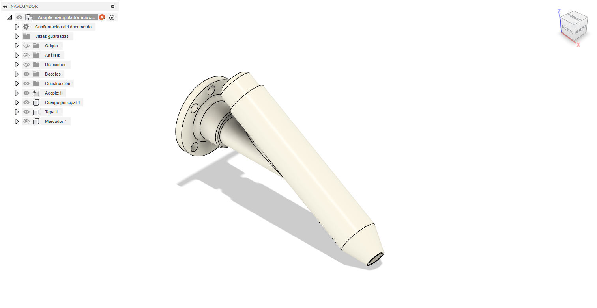
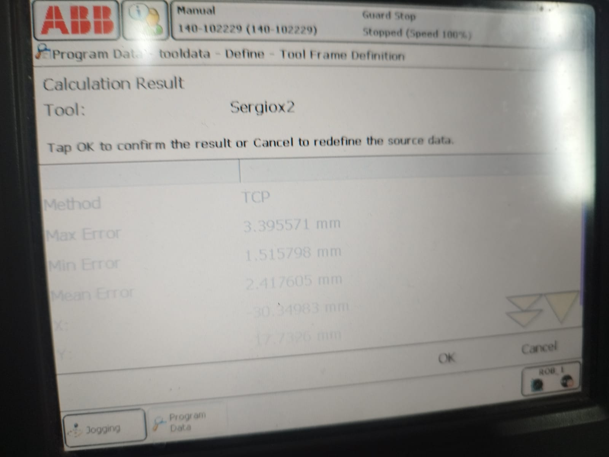
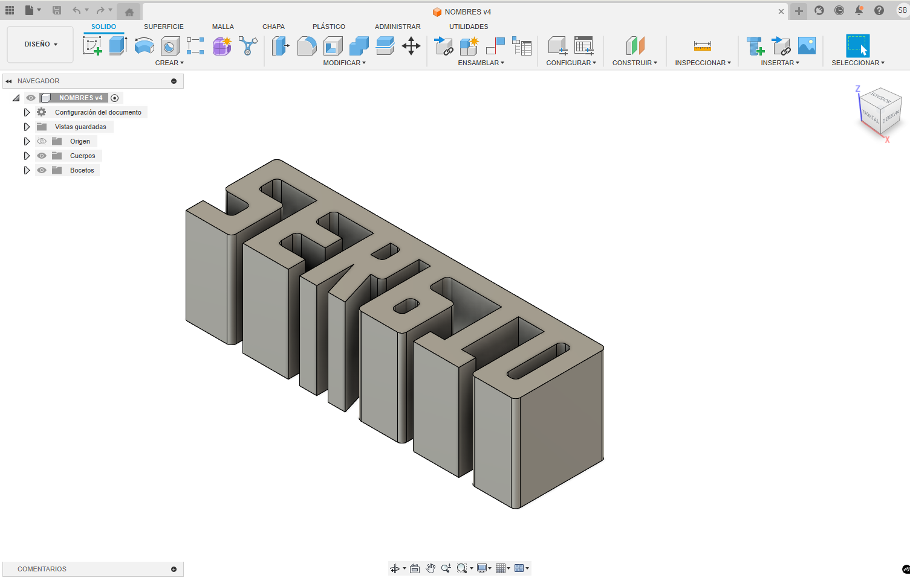

# 🎂 ABB IRB 140 - Emulacion de decorador de Tortas  (Lab 1 - Robótica Industrial)

Este proyecto emula una celda robotizada de decoración de pasteles utilizando un robot **ABB IRB 140**. El sistema, desarrollado en **RobotStudio** y ejecutado tanto en simulacion como en el robot real, traza trayectorias que forman nombres y adornos sobre una caja que emula a una torta. En la simulacion se emulo la banda transportadora utilizando un linear smart component, mientras que en el laboratorio LABSIR de la UNAL bogota se utilizaron bandas y logica cableada real.

---

## 📦 Requisitos

* RobotStudio (v5 o superior)
* Controlador IRC5 con módulo DSQC652
* Herramienta física (marcador montado)
* Software CAD para generar archivo `.SAT`
* Robot ABB IRB 140 y banco de trabajo.
* Memoria USB y/o cable Ethernet RJ-45.

---

## 🧁 Descripción del Laboratorio

### Objetivo

Simular la decoración de una torta para 20 personas escribiendo los **nombres de los integrantes del equipo** y una **decoración libre**, respetando restricciones de zona, velocidad y trayectoria.

### Restricciones técnicas

* Velocidades entre `v100` y `v1000`
* Tolerancia de zona: `z10`
* Movimiento continuo desde y hacia la posición `Home`
* Implementacion de dos entradas digitales conectadas a pulsadores que permitan controlar la rutina de decoracion del pastel y el desplazamiento del robot a una zona de mantenimiento y/o cambio de herramienta
* Implementacion de 2 salidas digitales, una para activar un piloto cuando se esta en la rutina de decoracion, y otra para activar o desactivar la banda transportadora.
* Decoración sobre cuadrantes x(+), y(+), y su espejo x(+), y(–) cambiando solo el Work object.


## 🛠️ Herramienta Personalizada

Se diseñó una herramienta que permite sujetar un plumón al flanche del robot, para lo cual se uso el software Fusion 360.



*Figura: Modelo CAD de la herramienta diseñada para contener el marcador. Se observan el ángulo de inclinación de 30 grados y la terminación con la forma del marcador.*


*Figura: Herramienta personalizada montada sobre el ABB IRB 140. Se muestran los ejes del TCP y su orientación.*


## 🎥 *Calibración de herramienta (TCP)*
Para calibrar la herramienta se utilizó el método de cuatro puntos, mediante el cual se determinó la posición del punto central de la herramienta (TCP). El proceso arrojó un error general de 2,42 mm en la calibración con un mínimo de 1.51 mm y un máximo de 3.40 mm.

<video width="1080" height="720" controls>
  <source src="assets/video/calibracion-tcp.mp4" type="video/mp4">
  Tu navegador no soporta video HTML5.
</video>



---

 

## 🗺️ WorkObject y Escenario

Se definió un `WorkObject` con referencia al plano del pastel, permitiendo replicar las trayectorias en dos cuadrantes:

* Cuadrante principal: `x(+)`, `y(+)`
* Cuadrante reflejado: `x(+)`, `y(–)`

---

## 🗺️ Plano de Planta

A continuación se presenta una vista desde arriba (top view) de la celda robótica. Se observan claramente el robot ABB IRB 140, el transportador, la ubicación del pastel (la caja).


*Figura: Plano de planta de la celda. Se muestra la ubicación del robot, el pastel, y las trayectorias de trabajo.*

---

## ✏️ Diseño de Trayectorias

Se crearon trayectorias para:

* **Nombres del equipo:** Sergio en los dos casos
* **Decoración libre:** para lo cual se dibujo una estrella.



*Figura: Diseño en CAD del texto "SERGIO", con todas las letras unidas por la parte superior, de esta forma no se levanta tantas veces el marcador.*


*Figura: Diseño en CAD de la estrella como decoración libre.*


*Figura: Vista general de las trayectorias para letras y adorno con targets asignados.*

---

## 💻 Código RAPID

El siguiente fragmento muestra cómo se ejecuta la rutina desde `main()`:

```rapid
PROC main()
        WHILE TRUE DO
            !---------Cake decoration Routine-----------
            IF DI_01=1 THEN
                Reset DO_03;
                Set DO_01;
                set Conveyor_FWD;
                WaitTime 3.8;
                Reset Conveyor_FWD;
                Path_Home;
                Routine_cake1;
                Path_Home;
                Routine_cake2; 
                Path_Home;
                Reset DO_01;
            ENDIF
            !----------Change tool position Routine/Maintenance ----------------
            IF DI_02=1 THEN
                Reset DO_01;
                Set DO_03;
                Path_Home;
                Path_maintenance;
            ENDIF
            
         ENDWHILE
    ENDPROC
```
Este codigo como se aprecia en los respectivos comentarios tiene 2 rutinas de pastel, en donde la del pastel1 es la que se realiza  sobre la banda transpostadora, y el pastel 2 es el que esta en otro cuadrante y para el cual solo se define otro work object y se reutiliza la respectiva rutina, por otro lado se tiene la rutina de mantenimiento.(todo esto se aprecia mucho mejor en el video explicativo de la simulacion) 
 
### 🔍 Descripción de funciones RAPID utilizadas

* **`main()`**: bucle principal que espera una señal digital de entrada para su activacion.
* **` Routine_cake1`** y * **` Routine_cake2`**: Realiza el llamado a las respetivas trayaectorias para decoracion del pastel.
* * **`Path_maintenance`**: Realiza el llamado a la rutina de mantenimiento.
* Se usan señales de entrada digitales(` DI_01`, ` DI_02`), las cuales estan conectadas a pulsadores en la realidad y activan la rutina de decoracion de pasteles y de mantenimiento respectivamente.
* Se usan señales de salida Digitales (DO_01`, `DO_02` y `Conveyor_FWD`), las dos primeras estan conectadas a pilotos para verificacion visual, mientras que la ultima es la que esta conectada a la banda transportadora.

---

## 🧪 Resultados

El resultado obtenido a partir de todo el procedimiento previo, utilizando el robot real del laboratorio, es el siguiente:

<video width="1080" height="720" controls>
  <source src="assets/video/resultado-final.mp4" type="video/mp4">
  Tu navegador no soporta video HTML5.
</video>

Adicionalmente, se realiza la misma prueba a la máxima velocidad permitida utilizando el botón de hombre muerto, la cual es de 300mm/s.

<video width="1080" height="720" controls>
  <source src="assets/video/resultado-rapido.mp4" type="video/mp4">
  Tu navegador no soporta video HTML5.
</video>


 ## 🔄 Diagrama de Flujo de Acciones del Robot

 

*Figura: Diagrama de flujo con control sobre eventos de la banda transportadora virtual.*

El sistema simula una celda con múltiples pasteles avanzando sobre una banda. Cuando un pastel llega a un punto de control (definido por un PlaneSensor), se detiene momentáneamente y luego continúa su avance hasta el siguiente sensor. En ese momento, Se puede apreciar una señal de entrada que, aunque está creada, no se encuentra conectada al SmartComponent. Dicha señal representaría una salida del controlador que daría inicio a la secuencia correspondiente. Sin embargo, en este caso el proceso se ha configurado como completamente automático, activándose mediante la señal negada del sensor.Un paso adiconal importante es  agregar las correpsondientes señales al controlador y conectarlas  en el Station Logic.

1. El sensor activa una señal.
2. El robot inicia la rutina `Path_MD()` sobre el objeto detectado.
3. Tras finalizar, se reactiva  `LinearMove`.
4. El siguiente pastel es generado desde el `Source` y repite el ciclo.

A continuación se muestra el diagrama del Smart Component utilizado en la simulación:


*Figura: Diagrama completo del Smart Component. Se incluyen componentes como Timer, Source, Queue, LinearMove y PlaneSensors con lógica condicional.*

Nota: El sistema cuenta con una entrada digital llamada START, que en un entorno físico podría estar conectada a un pulsador o interfaz de usuario para habilitar el ciclo de trabajo. En esta simulación, dicha señal se mantiene siempre en estado activo (ON), lo que permite que el sistema funcione de manera continua sin intervención manual.

## Esta integración permite simular un entorno semiautónomo de producción por lotes.

* 🎥 *\[Video de la simulación en RobotStudio]*  

https://github.com/user-attachments/assets/b8160525-beae-4d17-a3f1-f0e78ddf8949


## 📌 Conclusiones

* Se aplicaron conceptos de espacio de trabajo, TCP y WObj para trasladar trayectorias entre cuadrantes.
* El uso de `MoveC` permitió representar geometrías curvas de forma fluida.
* La integración de sensores y flujo de objetos mediante Smart Components enriqueció la simulación industrial.
* La experiencia reforzó habilidades en CAD, simulación, programación RAPID y lógica de control de procesos.

---

## 📂 Archivos del Proyecto

El proyecto completo está organizado en las siguientes carpetas y archivos:

| Archivo/Carpeta         | Descripción                                                |
| ----------------------- | ---------------------------------------------------------- |
| `Lab2.rsproj` | Proyecto completo de RobotStudio empaquetado (`Pack & Go`) |
| `Tool_CAD.SAT`          | Modelo CAD de la herramienta para sujetar marcador         |
| `Pastel_MD.SAT`    | Modelo CAD del WorkObject (pastel)                         |
| `vid/`               | Carpeta con videos de simulación, ejecución y calibración  |
| `img/`             | Carpeta con capturas y diagramas utilizados en el informe  |


---

## 🧠 Notas

* Es importante tener bien calibrada la herramienta.
* Se emplearon herramientas nativas de RobotStudio, programación RAPID y Smart Components.

---

## 🔗 Referencias

* [ABB RAPID Language Manual](https://library.abb.com/)
* [RobotStudio Online Help](https://developercenter.robotstudio.com/)
* [LabSIR - Universidad Nacional](https://labsir.unal.edu.co/)
